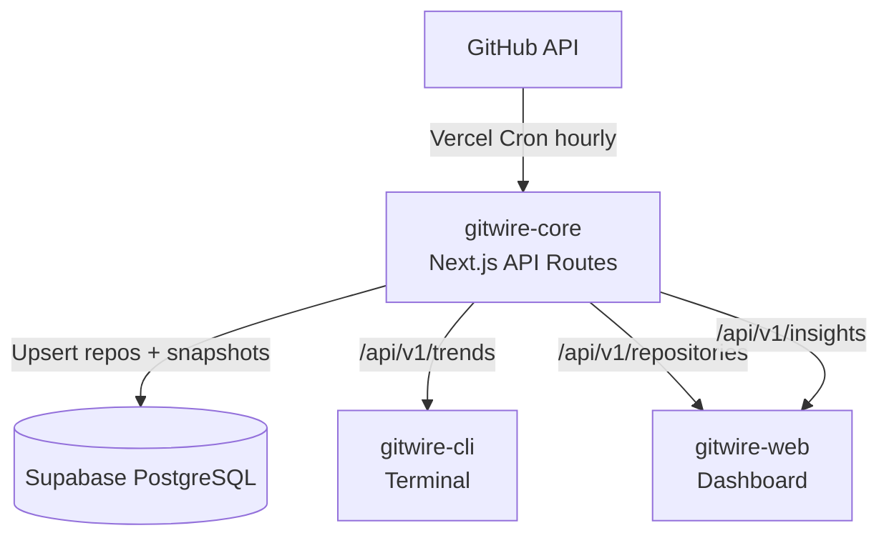

<h1 align="center">GitWire Core</h1>

<p align="center">
  <a href="#"></a>
  <a href="#"></a>
  <a href="#"></a>
  <a href="#"></a>
  <a href="#"></a>
  <a href="LICENSE"></a>
</p>

<p align="center">
  Backend API hub for the GitWire platform.<br/>
  Collects GitHub trending data, manages Supabase persistence, and serves REST endpoints<br/>
  consumed by both the <a href="https://github.com/ingeun92/gitwire-cli">CLI</a> and <a href="https://github.com/ingeun92/gitwire-web">Web</a> frontend.
</p>

---

## Architecture



## Tech Stack

| Layer | Technology |
|-------|------------|
| Runtime | Next.js 15 (App Router, API Routes only) |
| Language | TypeScript 5.7 |
| Database | Supabase (PostgreSQL) |
| Linting | ESLint 9 (flat config) |
| Hosting | Vercel |
| Data Pipeline | Vercel Cron |

## Getting Started

### Prerequisites

- Node.js >= 18
- A [Supabase](https://supabase.com) project

### Install & Run

```bash
# npm
npm install

# pnpm
pnpm install
```

```bash
cp .env.local.example .env.local   # fill in your keys
npm run dev                         # http://localhost:3000
# or
pnpm dev
```

### Environment Variables

| Variable | Required | Description |
|----------|:--------:|-------------|
| `SUPABASE_URL` | Yes | Supabase project URL |
| `SUPABASE_SERVICE_ROLE_KEY` | Yes | Supabase service role key |
| `CRON_SECRET` | Yes | Secret token for cron endpoint auth |
| `GITHUB_TOKEN` | No | GitHub PAT for higher rate limits |

### Database Setup

```bash
# Option A: Supabase CLI
supabase db push

# Option B: Run SQL manually in Supabase Dashboard
# Files:
#   supabase/migrations/001_initial_schema.sql
#   supabase/migrations/002_add_repo_metadata.sql
```

## API Reference

### `GET /api/v1/repositories`

Returns enriched repository data with star deltas, velocity, and sparkline.

**Parameters:**

| Param | Type | Default | Description |
|-------|------|---------|-------------|
| `sort` | string | `total_stars` | Sort column: `total_stars`, `stars_24h`, `stars_1w`, `stars_1m`, `name`, `pushed_at` |
| `order` | `asc` \| `desc` | `desc` | Sort direction |
| `language` | string | — | Filter by language (case-insensitive) |
| `limit` | number | `30` | Results per page (1-100) |
| `offset` | number | `0` | Pagination offset |

<details>
<summary><b>Response Example</b></summary>

```json
{
  "data": [
    {
      "id": "uuid",
      "github_url": "https://github.com/owner/repo",
      "name": "owner/repo",
      "description": "A cool project",
      "language": "TypeScript",
      "total_stars": 128500,
      "total_forks": 27400,
      "open_issues_count": 2841,
      "license_name": "MIT",
      "topics": ["react", "framework"],
      "pushed_at": "2026-03-18T10:00:00Z",
      "created_at_gh": "2016-10-05T00:00:00Z",
      "archived": false,
      "homepage_url": "https://example.com",
      "stars_24h": 187,
      "stars_1w": 1240,
      "stars_1m": 4820,
      "star_velocity_pct": 0.146,
      "sparkline_7d": [127200, 127450, 127700, 127900, 128050, 128300, 128500],
      "latest_snapshot_time": "2026-03-18T12:00:00Z"
    }
  ],
  "total": 30
}
```

</details>

### `GET /api/v1/trends`

Returns top trending repositories by star growth (legacy endpoint, used by CLI).

**Parameters:**

| Param | Type | Default | Description |
|-------|------|---------|-------------|
| `window` | `24h` \| `1w` \| `1m` | `24h` | Time window for star growth |

### `GET /api/v1/insights`

Returns published investment insights.

**Parameters:**

| Param | Type | Default | Description |
|-------|------|---------|-------------|
| `limit` | number | `10` | Number of insights to return (1-100) |

## Database Schema

| Table | Description |
|-------|-------------|
| `repositories` | GitHub repository metadata (URL, name, stars, forks, issues, license, topics, timestamps) |
| `trend_metrics` | Star growth snapshots (24h, 1w, 1m) with `total_stars_snapshot` for delta calculation |
| `investments` | Funding round data linked to repositories |
| `insights` | Markdown editorial content with publish status |

### Star Delta Calculation

The cron job stores `total_stars_snapshot` with each hourly snapshot. Star deltas are calculated by comparing the current total against historical snapshots:

```
stars_24h = current_stars - snapshot_24h_ago
stars_1w  = current_stars - snapshot_7d_ago
stars_1m  = current_stars - snapshot_30d_ago
```

## Deployment

```bash
vercel
```

Set environment variables in the Vercel dashboard. The cron job is auto-configured via `vercel.json` to run hourly.

## Related

- [`gitwire-cli`](https://github.com/ingeun92/gitwire-cli) - Terminal interface for developers & AI agents
- [`gitwire-web`](https://github.com/ingeun92/gitwire-web) - Professional data dashboard

## License

[MIT](LICENSE)
